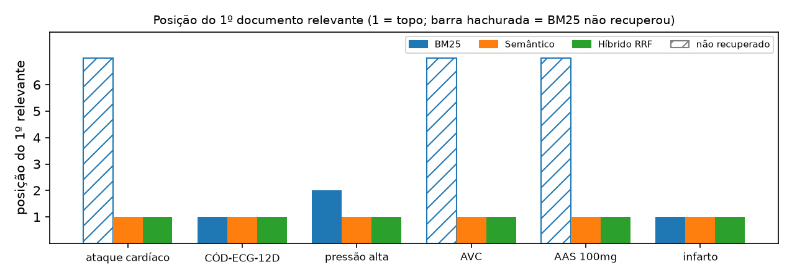

# HealthSearch — Relatório Técnico

Laboratório Prático 05 · Tendências em Ciência da Computação · Prof. Me. Ricardo Roberto de Lima · **Equipe:** Victor (entrega individual) · 28/09/2026.

## 1. Arquitetura

Um único arquivo Streamlit (`healthsearch_app.py`). A lógica fica em funções puras, uma por fase, e a interface em `main()`.

| Fase | Implementação |
|---|---|
| 1. Corpus e pré-processamento | as 6 diretrizes em hardcode (ID, título, trecho); minúsculas e sem acentos, remoção de caracteres especiais (o hífen dos códigos fica) e das stopwords em português. Códigos entram inteiros e em partes: “ECG-12D” acha “CÓD-ECG-12D”. |
| 2. BM25 | `rank_bm25.BM25Okapi`, refeito a cada mudança dos sliders k1 (0 a 3, padrão 1,2) e b (0 a 1, padrão 0,75). Com k1 = 0 a biblioteca calcula 0/0 nos documentos sem o termo; o app soma termo a termo e usa o limite correto (0). |
| 3. Semântico | `sentence-transformers` com `multilingual-e5-small` (prefixos “query: ” e “passage: ”) e similaridade de cosseno. Alternativa na barra lateral: `paraphrase-multilingual-MiniLM-L12-v2`. |
| 4. RRF | Score(D) = α/(60 + Rank_BM25) + (1 − α)/(60 + Rank_Sem), com ranks a partir de 1. Documentos empatados (por exemplo, todos com BM25 = 0) dividem a mesma posição, para ninguém ser favorecido pelo ID. |
| Interface | abas Léxico (BM25), Semântico, Híbrido RRF e Matriz Comparativa; sliders de k1, b e α; botões com as consultas dos pontos cegos; tempo de cada motor; métricas P@1, MRR e Recall@3 num gabarito de 18 consultas; curva do MRR em função de α. |

## 2. Comparação de ranks

- **Ponto cego do BM25:** em “ataque cardíaco”, “AVC” e “AAS 100mg” nenhuma diretriz contém os termos, e o BM25 não recupera nada. Em “pressão alta”, a palavra “alta” leva o BM25 à reanimação (“alta qualidade”). O semântico e o híbrido trazem o infarto, o AVC isquêmico e a crise hipertensiva.
- **Ponto cego do semântico:** em “CÓD-ECG-12D” ele acerta a ordem, mas dá notas parecidas a tudo: a separação entre os relevantes e o resto é de 7% da nota máxima, contra 97% no BM25, que zera quem não tem o código.
- **Híbrido RRF:** cobre os dois casos. Quando os motores discordam em posições espelhadas, α = 0,5 gera empate (“pressão alta”); α menor dá preferência ao semântico.

## 3. Métricas de desempenho

Gabarito de 18 consultas com as diretrizes relevantes marcadas à mão: metade na linguagem do plantão (sinônimos e siglas), metade com termos técnicos e códigos. Nos empates, vale a média sobre as ordens possíveis.

| Consultas | Motor | P@1 | MRR | Recall@3 |
|---|---|---|---|---|
| todas | BM25 | 0,67 | 0,69 | 0,69 |
| todas | Semântico | 1,00 | 1,00 | 1,00 |
| todas | Híbrido RRF | 0,97 | 0,99 | 1,00 |
| sinônimo ou sigla | BM25 | 0,40 | 0,45 | 0,50 |
| sinônimo ou sigla | Semântico | 1,00 | 1,00 | 1,00 |
| sinônimo ou sigla | Híbrido RRF | 0,95 | 0,97 | 1,00 |
| termo exato ou código | BM25 | 1,00 | 1,00 | 0,94 |
| termo exato ou código | Semântico | 1,00 | 1,00 | 1,00 |
| termo exato ou código | Híbrido RRF | 1,00 | 1,00 | 1,00 |

Com o e5, o semântico já acerta todo o gabarito, e o híbrido chega a MRR 1,0 com α ≤ 0,4. Com o `paraphrase-multilingual-MiniLM-L12-v2`, o semântico cai para MRR 0,86 (não põe um relevante em 1º em “infarto”, “AAS 100mg”, “AVC”, “RCR”). O híbrido fica com 0,86: o que ele ganha em “infarto” (o BM25 acerta) perde em “pressão alta” (o BM25 erra). **Conclusão:** num corpus pequeno, o RRF funciona como seguro, porque nunca cai para o MRR 0,45 do BM25 em sinônimos e mantém a precisão em códigos. Mas ele não supera o melhor motor sozinho quando os dois discordam só no topo.

## 4. Divisão de tarefas

| Tarefa | Responsável |
|---|---|
| Pré-processamento, BM25 e RRF | Victor |
| Motor semântico e escolha do modelo | Victor |
| Interface Streamlit e métricas | Victor |
| Relatório | Victor |
